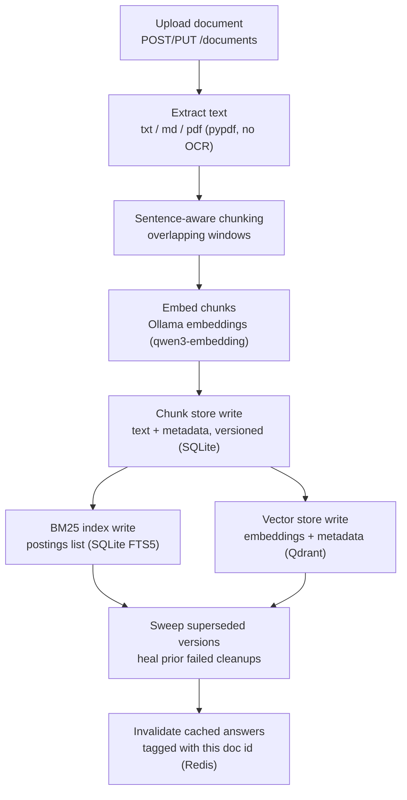
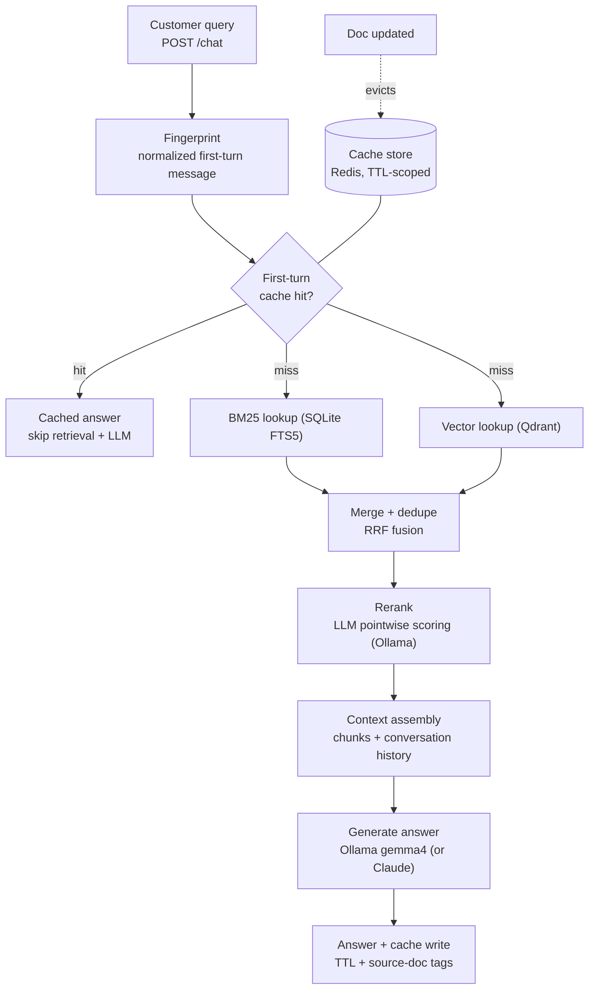

# customer-service-rag

A demo of production-grade customer-service RAG (retrieval-augmented
generation): a document-upload API and a grounded chat API that answers
support questions from your own help-center docs, with citations.

It runs **fully local via [Ollama](https://ollama.com)** — no API keys by
default. Python 3.12, FastAPI, LangChain (behind a thin adapter), SQLite +
Qdrant + Redis, all in Docker. A cloud LLM (Claude) is an opt-in
config swap, not a requirement.

What it does, end to end:

- **Upload** a `.txt` / `.md` / `.pdf` support doc; it is chunked,
  embedded, and indexed into both a keyword (BM25) and a vector store.
- **Ask** a question; it is answered from the retrieved chunks only —
  grounded, cited, and refusing rather than hallucinating when it finds
  nothing.
- **Cache** identical first-turn questions so common FAQs skip the whole
  pipeline — and **invalidate** those cached answers the instant the
  source document changes.

This is an API-only demo built one small PR at a time (TDD,
subagent-reviewed, security-checked). The design rationale lives in
[`docs/decisions.md`](docs/decisions.md).

## Architecture

Two pipelines: one writes documents into the stores, one answers
questions from them.

### Ingestion pipeline



Chunking and embedding run **before** any write, so the likeliest failure
(an Ollama call) aborts with nothing to undo. The writes are compensated
on failure — the previously active version keeps serving throughout — and
older versions are swept only after the new one is fully written. See the
[atomicity decision](docs/decisions.md#compensation-based-atomicity-not-cross-store-2pc).

### Query pipeline



If retrieval returns no chunks, the LLM is never called — a fixed
escalation answer is returned instead (grounded refusal). A generation
failure becomes a `503` and leaves the session untouched so a retry
replays cleanly.

### Layers and module layout

- **FastAPI app** (`src/app/main.py`) — the application factory. Builds
  the ingestion service, the chat/retrieval stack, and dedicated readiness
  handles once at startup, shares them via `app.state`, closes them on
  shutdown. Serves `/health` (liveness) and `/ready` (dependency checks).
- **API** (`src/app/api/`) — `documents.py` (upload/update, size caps,
  doc-id validation, off-event-loop ingest) and `chat.py` (the query
  pipeline as an HTTP handler, with the one observability seam).
- **Ingestion** (`src/app/ingestion/`) — `extractors.py` (txt/md/pdf),
  `chunker.py` (sentence-aware overlapping windows), `pipeline.py`
  (orchestration, compensation-based atomicity, supersede sweep, cache
  invalidation).
- **Retrieval** (`src/app/retrieval/`) — `embedder.py` (Ollama
  embeddings), `hybrid.py` (BM25 + vector, RRF fusion), `reranker.py`
  (LLM pointwise scoring), `pool.py` (per-slot read connections for
  concurrent chat).
- **Stores** (`src/app/stores/`) — `chunk_store.py` (versioned SQLite),
  `bm25_index.py` (SQLite FTS5), `vector_store.py` (Qdrant),
  `cache.py` (Redis response cache + tag-set invalidation),
  `sessions.py` (Redis conversation history).
- **Chat** (`src/app/chat/`) — `fingerprint.py` (cache key),
  `context.py` (context assembly + prompt-injection guards),
  `llm.py` (the `LLMClient` seam and its LangChain adapters).
- **Eval** (`src/app/eval/`) — the retrieval eval harness and its
  `python -m app.eval` CLI.

Full rationale for each choice is in [`docs/decisions.md`](docs/decisions.md).

## Quickstart

Run the whole stack and watch a cached answer change the moment its source
document is edited.

### Prerequisites

- **Docker** (Compose v2).
- **[Ollama](https://ollama.com) running on the host** with the demo
  models pulled:

  ```
  ollama pull gemma4
  ollama pull qwen3-embedding
  ```

  Ollama is **not** a Compose service — it runs on the host (to use your
  GPU) and the app container reaches it at `host.docker.internal:11434`.

### 1. Configure

```
cp .env.example .env
```

The defaults are keyless (Ollama for everything). `.env` is gitignored;
never commit real keys.

### 2. Start the stack

```
docker compose up --build
```

This starts the app on `127.0.0.1:8000`, Qdrant on `:6333`, and Redis on
`:6379` (all bound to loopback). Wait for the app to report healthy:

```
curl -s localhost:8000/health   # {"status":"ok"}
curl -s localhost:8000/ready    # {"status":"ready","dependencies":{...}}
```

### 3. Upload a support doc

```
curl -F file=@data/samples/password-reset.md http://localhost:8000/documents
```

### 4. Ask a question — grounded answer with a citation

```
curl -X POST http://localhost:8000/chat \
  -H 'Content-Type: application/json' \
  -d '{"session_id":"demo-1","message":"How long is the password reset link valid for?"}'
```

### 5. Ask the same question again — served from cache

```
curl -X POST http://localhost:8000/chat \
  -H 'Content-Type: application/json' \
  -d '{"session_id":"demo-2","message":"How long is the password reset link valid for?"}'
```

`cached` flips to `true` (a first-turn FAQ hit — the fingerprint keys on
the message, so a different session still hits the same entry).

### 6. Edit the doc and re-upload — the answer changes

Change "30 minutes" to "60 minutes" in the doc and `PUT` it back:

```
curl -X PUT http://localhost:8000/documents/password-reset \
  -F file=@password-reset-edited.md

curl -X POST http://localhost:8000/chat \
  -H 'Content-Type: application/json' \
  -d '{"session_id":"demo-3","message":"How long is the password reset link valid for?"}'
```

The `PUT` invalidates the cached answer; the next question re-runs the
pipeline, answers "60 minutes", and cites the new document version. That
precise invalidation is the whole point of the caching design.

### Real transcript

Captured against a live stack (Ollama `gemma4` + `qwen3-embedding`,
Qdrant, Redis) — this is the exact sequence above:

```console
$ curl -F file=@data/samples/password-reset.md http://localhost:8000/documents
{"doc_id":"password-reset","version":1,"chunk_count":1}

$ curl -X POST http://localhost:8000/chat -H 'Content-Type: application/json' \
    -d '{"session_id":"demo-1","message":"How long is the password reset link valid for?"}'
{"answer":"The reset link is valid for 30 minutes.",
 "sources":[{"chunk_id":"password-reset:1:0","doc_id":"password-reset",
             "title":"Resetting your password"}],
 "cached":false}

# same first-turn question again -> served from cache
$ curl -X POST http://localhost:8000/chat -H 'Content-Type: application/json' \
    -d '{"session_id":"demo-2","message":"How long is the password reset link valid for?"}'
{"answer":"The reset link is valid for 30 minutes.",
 "sources":[{"chunk_id":"password-reset:1:0","doc_id":"password-reset",
             "title":"Resetting your password"}],
 "cached":true}

# edit "30 minutes" -> "60 minutes", PUT it back -> cache invalidated
$ curl -X PUT http://localhost:8000/documents/password-reset -F file=@password-reset-edited.md
{"doc_id":"password-reset","version":2,"chunk_count":1}

# ask again -> answer CHANGES, cited to version 2, cached back to false
$ curl -X POST http://localhost:8000/chat -H 'Content-Type: application/json' \
    -d '{"session_id":"demo-3","message":"How long is the password reset link valid for?"}'
{"answer":"The password reset link is valid for 60 minutes.",
 "sources":[{"chunk_id":"password-reset:2:0","doc_id":"password-reset",
             "title":"Resetting your password"}],
 "cached":false}
```

The demo corpus in `data/samples/` is a fictional SaaS product's support
docs (password reset, billing, shipping, returns, account deletion, API
keys, contact support) — upload all of them to explore a fuller corpus.

## Using a cloud LLM instead

Generation sits behind an `LLMClient` Protocol with two adapters, so
swapping Ollama for Claude is config only — no code change. In `.env`:

```
LLM_PROVIDER=anthropic
ANTHROPIC_API_KEY=sk-ant-...        # your key; never commit it
ANTHROPIC_MODEL=claude-sonnet-5     # optional; this is the default
```

`LLM_PROVIDER=anthropic` requires a non-empty `ANTHROPIC_API_KEY` (Settings
validates this at load time). Embeddings and reranking still use Ollama;
only answer generation moves to Claude. This is the documented
bring-your-own-key path — the default demo stays keyless.

## API reference

All routes are unauthenticated (auth is a non-goal). Uploads are capped at
`MAX_UPLOAD_BYTES` (default 5 MB) and read incrementally.

| Method & path | Purpose | Success |
|---|---|---|
| `POST /documents` | Upload a new document (multipart `file`, optional `doc_id` form field) | `201` |
| `PUT /documents/{doc_id}` | Re-upload/update a document under an explicit id | `200` |
| `POST /chat` | Ask a grounded question (JSON `session_id`, `message`) | `200` |
| `GET /health` | Liveness probe (process is up) | `200` |
| `GET /ready` | Readiness probe (pings SQLite, Qdrant, Redis) | `200` / `503` |

### `POST /documents` — upload

`multipart/form-data` with a `file` part; `doc_id` is an optional form
field (defaults to a slug of the filename).

```
curl -F file=@data/samples/billing.md http://localhost:8000/documents
```

```json
{ "doc_id": "billing", "version": 1, "chunk_count": 1 }
```

`PUT /documents/{doc_id}` takes the same `file` part and returns the same
shape with an incremented `version` (and `200` instead of `201`).

Error responses (detail carries only ids/filename/size — never document
content):

| Status | When |
|---|---|
| `413` | Body exceeds `MAX_UPLOAD_BYTES` |
| `415` | Unsupported file type (e.g. `.csv`) — `{"detail":"unsupported file type '.csv': 'data.csv' (8 bytes)"}` |
| `422` | Invalid `doc_id` — `{"detail":"invalid document id 'BadID'; must match [a-z0-9][a-z0-9-]{0,63}\\Z ..."}` |
| `422` | Empty/unextractable document, or an ingest failure — `{"detail":"could not ingest document 'x' from 'x.md'"}` |

### `POST /chat` — grounded chat

```json
{ "session_id": "demo-1", "message": "How long is the reset link valid?" }
```

- `session_id` must match `^[A-Za-z0-9_-]{8,64}$`.
- `message` is 1–2000 chars, non-blank once stripped.

Response:

```json
{
  "answer": "The reset link is valid for 30 minutes.",
  "sources": [
    { "chunk_id": "password-reset:1:0", "doc_id": "password-reset", "title": "Resetting your password" }
  ],
  "cached": false
}
```

`cached` is `true` only on a first-turn cache hit. When retrieval finds
nothing, `answer` is a fixed escalation message and `sources` is empty.

| Status | When |
|---|---|
| `200` | Answered (grounded, cached hit, or grounded refusal) |
| `422` | Malformed `session_id`, or blank / too-long `message` |
| `503` | `{"error":"generation_unavailable"}` — the LLM failed or returned empty; no turns are stored, so a retry is clean |

### `GET /ready`

```json
{ "status": "ready", "dependencies": { "sqlite": "ok", "qdrant": "ok", "redis": "ok" } }
```

Returns `503` with `"status":"not_ready"` if any dependency is down — named
by key only, never leaking a connection string.

## Testing and eval

### Unit + integration tests

```
make test     # uv run pytest
make lint      # ruff check + format check
```

Tests use `--import-mode=importlib` and treat warnings as errors. The
integration tests hit live Ollama/Qdrant and auto-skip when unreachable,
so `make test` is green with or without the services running. Ollama is
**not** run in CI; Qdrant and Redis are.

A docs drift guard (`tests/test_docs.py`) keeps this README honest: it
asserts every `make` target it mentions exists in the `Makefile`, and
every route path it documents exists in the app's route table.

### Retrieval eval

```
make eval             # hit-rate@k / precision@k / recall@k / MRR sweep
make eval             # (add --rerank for a with/without comparison)
uv run python -m app.eval --rerank
```

`make eval` ingests the sample corpus into a **throwaway** SQLite db and a
per-run Qdrant collection (never your configured production db/collection),
runs the metrics over the golden dataset (`data/eval/golden.jsonl` —
customer-phrased, some misspelled), prints a table, and cleans both up. It
needs live Ollama + Qdrant, so it is a local command, not a CI step; the
metric math is unit-tested with a fake retriever in CI.

**Recorded baselines** (7-doc sample corpus, 18 golden questions), from a
live `make eval` run:

| Metric | @1 | @3 | @5 |
|---|---|---|---|
| hit-rate | 83.3% | 100% | 100% |
| precision | 83.3% | 35.2% | 22.2% |
| recall | 77.8% | 97.2% | 100% |
| MRR | 0.898 | 0.898 | 0.898 |

- `hit-rate@5` is **saturated at 100%** — every relevant doc is in the top
  5, so hit-rate can't discriminate at this corpus size. The eval sweeps
  low `k` (1, 3, 5) where precision/recall/MRR actually move. (Precision
  falls at higher `k` because most questions map to a single relevant doc,
  so the extra slots are necessarily non-relevant.)
- **LLM reranking lifts precision@1 → ~1.0 and MRR → ~1.0** (it pulls the
  relevant chunk to rank 1, which the saturated hit-rate@5 can't show).
  Measured on #14's 8-question subset: precision@1 0.625 → 1.000,
  MRR 0.771 → 1.000.
- The cost is **gemma4 latency**: reranking adds ~seconds per query (a live
  `/chat` request in the transcript spent ~10.5s in rerank vs ~0.4s in
  retrieval). Run `make eval-rerank` for the full with/without latency
  table. See the
  [reranker decision](docs/decisions.md#llm-pointwise-reranker-over-a-cross-encoder--quality-vs-latency).

### Observability

Every `/chat` request emits exactly one structured JSON `request_summary`
log line — ids, route, status, `cache_hit`, per-stage timings, and
`total_ms`, and **never** any customer content. Stages that didn't run are
absent, so a cache hit is a one-line, sub-millisecond record. Real lines
from the transcript above:

```json
{"request_id":"...","route":"/chat","status":200,"cache_hit":false,
 "total_ms":12894.0,"retrieval_ms":383.2,"rerank_ms":10588.8,"llm_ms":1892.8,
 "event":"request_summary","level":"info","timestamp":"..."}
{"request_id":"...","route":"/chat","status":200,"cache_hit":true,
 "total_ms":6.5,"event":"request_summary","level":"info","timestamp":"..."}
```

The second line is a cache hit: no `retrieval_ms`/`rerank_ms`/`llm_ms`
because those stages never ran, and `total_ms` of 6.5 vs ~13000 for the
live answer. (`rerank_ms` dominating the live request is the gemma4
reranking latency the decision log discusses.)

## Non-goals

Deliberately out of scope for this demo (each with what production would
add, in [`docs/decisions.md`](docs/decisions.md#non-goals-deliberate)):

- **Auth** — no authn/authz; every route is open.
- **Rate limiting** — none.
- **Streaming responses** — answers return whole.
- **Multi-tenancy** — one shared corpus.
- **OCR** — scanned/image-only PDFs yield no text and are rejected.
- **Horizontal scaling** — SQLite single-writer is accepted; one ingest
  worker at a time.
- **A UI** — this is an API-only demo.

## Commands

| Command | What it does |
|---|---|
| `uv sync` | Install/refresh dependencies (pinned via `uv.lock`) |
| `make run` | Start the API locally (uvicorn with reload) |
| `make test` | Run the test suite (pytest) |
| `make lint` | ruff lint + format check |
| `make format` | Auto-format and auto-fix lint |
| `make eval` | Run the retrieval eval against live services |
| `make compose-check` | Validate `compose.yaml` |
| `docker compose up --build` | Run the full stack |

See [`CLAUDE.md`](CLAUDE.md) for the development workflow and architecture
overview, and [`docs/decisions.md`](docs/decisions.md) for the decision log.
